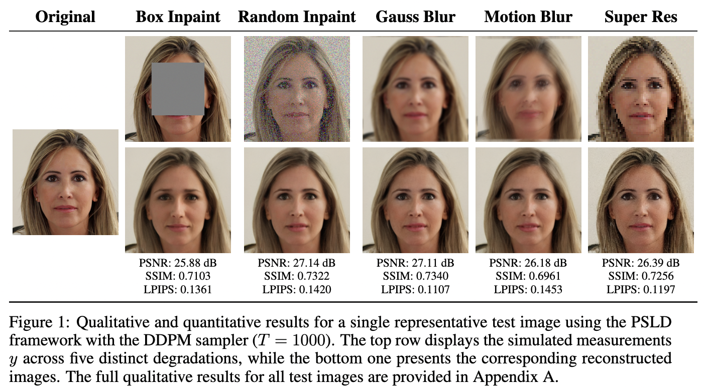

# Posterior Sampling with Latent Diffusion (PSLD) - Paper Review & Adaptation

This repository contains our implementation, review, and extension of the paper **[Solving Linear Inverse Problems Provably via Posterior Sampling with Latent Diffusion Models](https://arxiv.org/abs/2307.00619)** by Litu Rout, Negin Raoof, Giannis Daras, Constantine Caramanis, Alexandros G. Dimakis, and Sanjay Shakkottai.

Original PSLD GitHub repository: [LituRout/PSLD](https://github.com/LituRout/PSLD)

## Overview

While the original PSLD method elegantly solves linear inverse problems (Super-Resolution, Inpainting, Deblurring) in a highly compressed latent space, it traditionally relies on computationally expensive full diffusion schedules (e.g., $T=1000$ DDPM steps). 

**Our Contribution:** In this project, we adapted the PSLD mathematical framework to utilize accelerated non-Markovian **DDIM sampling with a low number of steps ($T=50$)**. 
Through extensive grid-search experiments, we evaluated the viability of this acceleration. Our findings reveal that while inference time drops dramatically (to ~1 minute per image), the algorithm exhibits an **extreme sensitivity to hyperparameters**. We provide a deep empirical analysis of the likelihood weight ($\eta$), the manifold gluing weight ($\gamma$), and the stochasticity parameter ($\eta_{DDIM}$), demonstrating that these parameters are highly problem-dependent.

## Repository Structure

* `src/psld.py` : Main implementation of the Posterior Sampling with Latent Diffusion algorithm.
* `src/hyper_testing.py` : Script dedicated to running automated 1D grid searches to find optimal hyperparameters ($\eta$, $\gamma$, $\eta_{DDIM}$).
* `results/analyse.ipynb` : Jupyter Notebook used to parse the generated CSV metrics.
* `src/operators.py` : Contains the `LinearOperator` class simulating physical degradations (Box/Random Inpainting, Gaussian/Motion Blur, Super-Resolution).
* `src/metrics.py` : Evaluation pipeline calculating PSNR, SSIM, and LPIPS.
* `src/utils.py` : Utility functions for tensor manipulations and image processing.
* `models/` : Directory intended for the pre-trained HuggingFace models (LDM UNet, VQ-VAE, Scheduler).
* `kernels/` : Contains external custom kernels (e.g., motion blur matrices).
* `results/` : Directory containing reconstructed images, degraded inputs, and `metrics_sweep.csv` files from the grid search.
* `paper.pdf` : The original paper.
* `report.pdf` : Our review and report on the paper.
